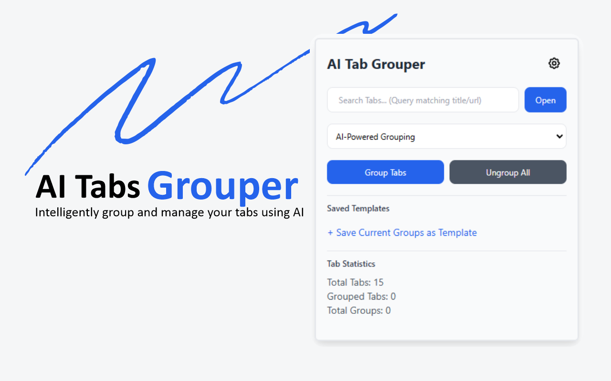
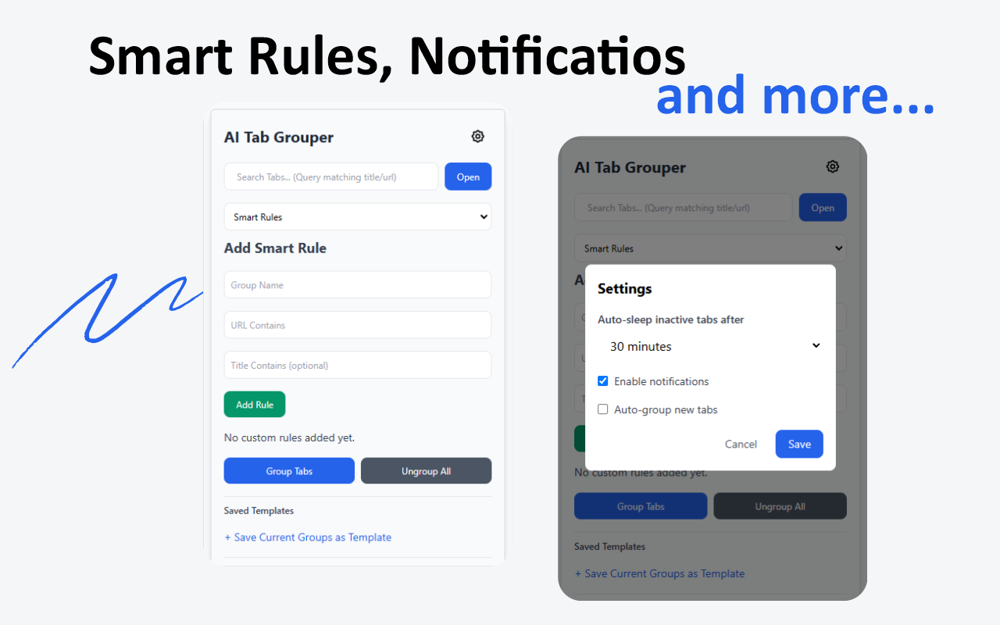
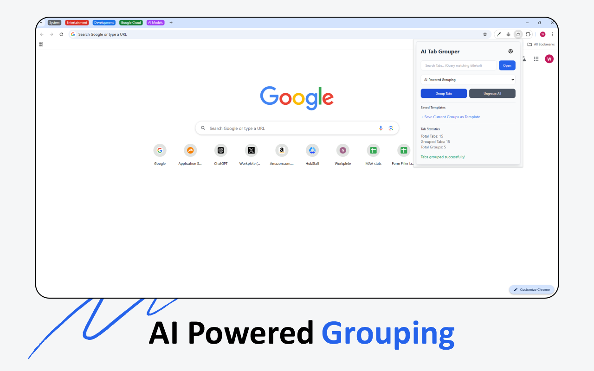

# 🚀 **AI Tab Grouper**

AI Tab Grouper is a powerful browser extension designed to help users manage their open tabs efficiently. By leveraging AI technology, it automatically groups tabs into categories, making it easier to navigate and organize your browsing experience.

## 🌐 Published Extension

You can find and install the AI Tab Grouper extension from the Chrome Web Store: [AI Tab Grouper](https://chromewebstore.google.com/detail/ai-tabs-grouper/lchmibpgifelmdmdaoejkibjpepkddbb)

## ✨ Features

- **Automatic Tab Grouping**: Uses AI to intelligently group tabs based on their content and context.
- **Manual Grouping**: Allows users to create custom categories for organizing tabs.
- **Smart Rules**: Set rules for automatic tab grouping based on URLs and titles.
- **Template Management**: Save and apply templates for quick tab organization.
- **User-Friendly Interface**: Intuitive UI that enhances user experience.
- **Cross-Browser Compatibility**: Works seamlessly on multiple browsers.

## 📸 Screenshots






## 🛠 Installation

1. Clone the repository:
   ```bash
   git clone https://github.com/yourusername/ai-tab-grouper.git
   ```
2. Navigate to the project directory:
   ```bash
   cd ai-tab-grouper
   ```
3. Install dependencies for the backend:
   ```bash
   pip install -r requirements.txt
   ```
4. Set up environment variables:
   - Create a `.env` file in the `Backend` directory and add your Google API key:
     ```
     GOOGLE_API_KEY=your_api_key_here
     ```
5. Load the extension in your browser:
   - For Chrome: Go to `chrome://extensions/`, enable "Developer mode", and click "Load unpacked". Select the `Extension` folder.

## 📦 Dependencies

- Flask
- Flask-CORS
- Google Generative AI
- dotenv

## 🖥 Usage Instructions

1. Open the browser and click on the AI Tab Grouper extension icon.
2. Choose your preferred tab grouping method:
   - **Automatic**: Let the AI group your tabs.
   - **Manual**: Create custom categories.
3. Manage your tabs using the provided options and settings.

## 🤝 Contributing

Contributions are welcome! Please fork the repository and submit a pull request for any enhancements or bug fixes.

## 📄 License

This project is licensed under the MIT License and is open-source. See the [LICENSE](LICENSE) file for more details.

## 📝 Changelog

Version 1.1.0

- Added support for saving and applying templates for quick tab organization.
- Fixed a bug with tab grouping when using the "By Activity" method.

Version 1.1.1

- Removed unwanted idle permissions from manifest.json

## About authors

- [Pankil Soni](https://github.com/pankil-soni) - AI Tab Grouper creator

## 🙌 Acknowledgments

Special thanks to [Google Generative AI](https://ai.google/) for providing the AI-powered LLM service.

---

<p align="center">🚀 Let's Group Tabs with AI!</p>
